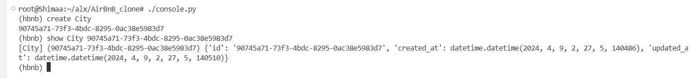

<center><h1>Air BNB Project</h1></center>
description of the project:
we are trying to make the data storage of a project called "AirBnb", accessed by console

Language: python

Storage: Json

tested: Unit_test

<h3>description of the command interpreter:</h3>


there are built-in commands within the console are used to managae the data such as:

create, show, destroy, all, update..

 we edit every function as we want

(line) => represent the input after the comand


<h3>how to start it</h3>
	by using ./console in the terminal

```
	#~./console.py
	(hbnb)
```

<h3>how to use it </h3>
	we use it to create objects, delete, modify, count all classes are there, 


<h3>examples<h3>


